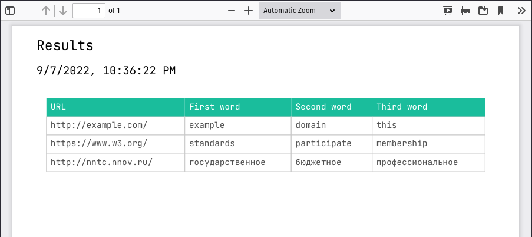

# Задание 1. REST-сервис на Node.js

## Описание задачи

> На Node.js написать REST-сервис со следующим функционалом:
>
> Анализ текста на сайтах: сервис должен принимать на вход массив URL'ов, анализировать страницы по этим адресам, и возвращать PDF документ, в котором в таблице будут представлены три наиболее часто встречающихся слова длиннее 4 символов по каждому из URL'ов.
>
> Примерно так:
>
> http://yandex.ru
>
> Программирование | Санкт-Петербург | Маркет
>
> http://habrahabr.ru
>
> Разработка | Коллеги | тестирование

## Примеры выполнения

### Пример 1

Запрос:

`GET http://localhost:3000/api/parse?sites[]=http://example.com&sites[]=https://www.w3.org&sites[]=http://nntc.nnov.ru&sites[]=https://does-not.exist&sites[]=ftp://www.yandex.ru`

Результат:



### Пример 2

`GET http://localhost:3000/api/parse?sites[]=http://does.not/exist`

Результат:

```
HTTP/1.1 502 Bad Gateway
Connection: keep-alive
Date: Wed, 07 Sep 2022 19:39:49 GMT
Keep-Alive: timeout=5
cache-control: no-cache
content-length: 108
content-type: application/json; charset=utf-8
```

```json
{
  "error": "Bad Gateway",
  "message": "Site http://does.not/exist is not responding properly",
  "statusCode": "502"
}
```

## Описание API

|  Маршрут   | Запрос |   Параметры   |       Ответ       |                                                                                         Описание                                                                                         |
| :--------: | :----: | :-----------: | :---------------: | :--------------------------------------------------------------------------------------------------------------------------------------------------------------------------------------: |
| /api/parse |  GET   | `sites[]=URL` | `application/pdf` | Анализ текста на страницах из массива `sites[]`, в качестве ответа возвращается PDF, в таблице которого представлены 3 наиболее повторяющихся слова длиннее 4 символов по каждому из URL |

## Используемые библиотеки

- [hapi.js](https://github.com/hapijs/hapi) - HTTP сервер
- [htmlparser2](https://github.com/fb55/htmlparser2) - парсер HTML страниц
- [domutils](https://github.com/fb55/domutils) - инструменты для работы с DOM htmlparser2
- [dotenv](https://github.com/motdotla/dotenv) - загрузка переменных среды из .env
- [joi](https://github.com/hapijs/joi) - проверка параметров запроса
- [jspdf](https://github.com/parallax/jsPDF) - создание PDF документов
- [jspdf-autotable](https://github.com/simonbengtsson/jsPDF-AutoTable) - создание таблиц в PDF
- [lodash](https://github.com/lodash/lodash) - упрощение работы с массивами и строками
- [qs](https://github.com/ljharb/qs) - парсинг параметров запроса и их преобразование в массив

## Используемые инструменты разработки

- [nodemon](https://github.com/remy/nodemon) - автоматический перезапуск сервера при обновлении исходников
- [typescript](https://github.com/Microsoft/TypeScript) - статическая типизация и инкрементальная компиляция при обновлении исходников
